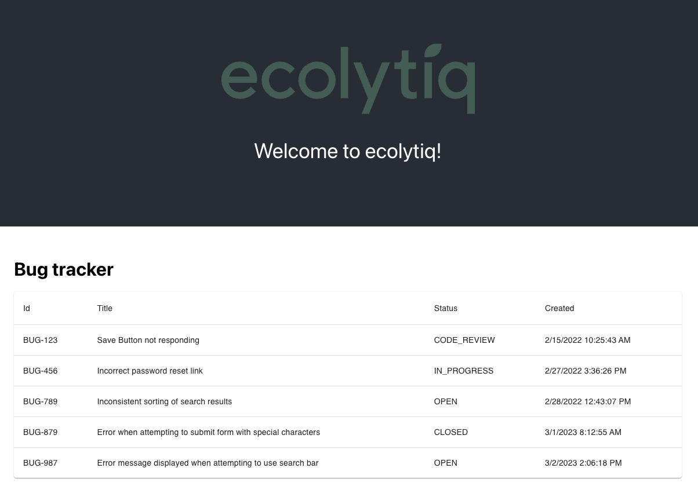

# Bug Tracker

Welcome to the ecolytiq coding challenge.

## Overview

This is a very simple bug tracker application that will act as the base for the coding challenge.\
The application consists of:
* A backend
  * written in Kotlin with Spring Boot
  * using a H2 in-memory database for persistence
  * exposing a REST API to get all bug tickets
* A frontend
  * written in TypeScript with React
  * consuming the REST API to get all bug tickets
  * showing the bug tickets in a table

## Preparation

As preparation for your upcoming tech interview please follow these steps:
1. Checkout this repository.
2. Import it as a project in your favorite IDE.
3. Make yourself familiar with the codebase.
4. Run the backend (see [backend/README.md](backend%2FREADME.md) for instructions).
5. Run the frontend (see [frontend/README.md](frontend%2FREADME.md) for instructions).
6. Open [http://localhost:3000](http://localhost:3000) in your browser. If everything was successful, you should see
this: 

If you encounter any problems then please reach out to your recruiter at ecolytiq.

## During the Interview

During the interview we will give you a small task to implement a new feature. We ask you to share your screen and
implement the feature while we are watching.\
The goal of the coding challenge is to see how you are working. It does not matter, if you can finish the task or not.\
You can use every resource (internet, other code, etc.) you want during the coding challenge.